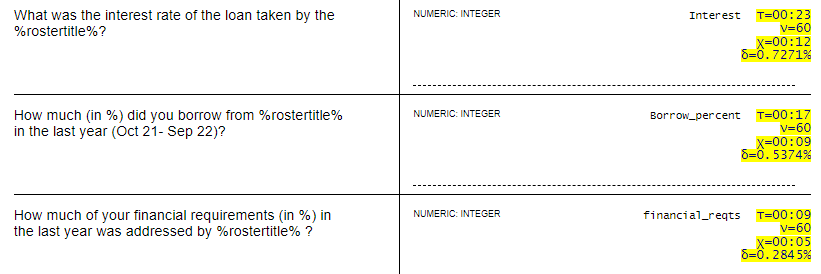

# paraquest

Questionnaire analysis from Survey Solutions' paradata.

The paradata file format is described in the Survey Solutions documentation [here](https://docs.mysurvey.solutions/headquarters/export/paradata_file_format/).

Changes and discrepancies are possible between different versions. This tool is written looking at paradata as recorded and exported by the contemporary version 22.06.

## Known limitations:

- only take into account the first session (before the first ***Completed*** event);
- does not take into account ***Restarted*** event;
- not compatible with partial synchronization, suspected bug in Survey Solutions: https://github.com/surveysolutions/surveysolutions/issues/2033
- setting comments is not supported - commenting time is dissolved in answers time.
- can detect (sometimes) clock adjustment backward, but can never detect clock adjustment forward

## Requires:

- susotime - user-written Stata module susotime is available from [GitHub](https://github.com/radyakin/susotime).

## Usage:

### Syntax
```
paraquest "C:\data\MyProjectFolder"
```


### Input

The path to the data folder is the only parameter supplied to the -paraquest- tool.

The supplied folder must contain all of the following:

1. `paradata.tab` file exactly as obtained from the Survey Solutions export facility (paradata mode);
2. `paradata.do` file exactly as obtained from the Survey Solutions export facility (paradata mode);
3. `questionnaire.html` questionnaire file in HTML format (can be located in main data export archive, --> Questionnaire/Preview/questionnaire.html).

File name for HTML file is irrelevant - this can be 'Q.html' or 'mysurvey.html', but it is essential that it has the '.html' extension and is the only `*.html` file in this directory.

If the questionnaire has multiple languages, you can select any one of them for this tool to process.

### Output

File `output.html` is created in the specified folder. This file can be opened with any browser (up-to-date versions of Chrome, Edge, Firefox).

The example output may look like this (fragment):



The output of **paraquest** is added to the questionnaire document to indicate:

- the time that this question contributes to the average interview, 	&tau;;
- number of interviews on which this estimate is based on, the number in the square brackets [#].

The output can be converted to PDF format by pressing ***Ctrl+P*** key combination in the browser. (For Mac computers use ***Command+P*** key combination).
